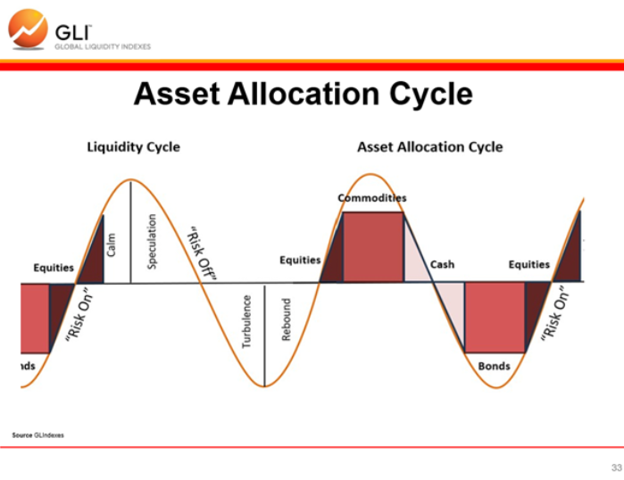

# Howell Phase Allocation Tutorial — AB4 Macro Rotation Framework (No Technical Overlay)
**Project:** P-AB4-STRAT  
**Date:** 2026-04-27  
**Author:** Cyler (CIO)  
**Status:** Draft for Gavin + Greg review

---

## Executive Summary

This document explains how AB4 should allocate capital across the full Howell phase cycle **absent technical analysis**.

## Reference Graphic

*Reference graphic added for phase-cycle orientation and discussion context.*

That means this tutorial answers the question:

> **If we only knew the current Howell macro phase and its transition direction, how should we expect AB4 allocations to change?**

This is deliberately a **macro-only tutorial**.

It does **not** use:
- chart structure
- trackline confirmation
- technical migration timing
- short-term price pattern interpretation

Those belong to later overlays.

The purpose here is to make the **phase-driven benchmark logic** visible and complete enough that Greg and Gavin can evaluate the framework before technical sequencing is layered on top.

---

## 1. Core AB4 Philosophy

AB4 is **not** a passive defensive bucket and it is **not** a diversification-for-its-own-sake portfolio.

AB4 is a:

> **Howell-conditioned, macro-rotating benchmark portfolio designed to preserve capital first while still seeking unusually strong risk-adjusted appreciation and yield through superior nimbleness and lower execution friction than institutions.**

### What that means in practice
- capital preservation matters
- appreciation still matters
- yield matters where appropriate
- concentration is allowed when evidence is strong
- any sleeve can go to zero
- no sleeve may exceed **40%**
- diversification is a tool, not an objective
- Howell determines the destination benchmark
- later technical overlays determine migration timing and execution finesse

---

## 2. What This Tutorial Covers

This tutorial defines:
1. the AB4 sleeve universe
2. the macro meaning of each Howell phase
3. the expected benchmark posture in each phase
4. the expected allocation shifts in transition states
5. how AB4 should think about offense, ballast, yield, and concentration **without technical timing input**

---

## 3. AB4 Sleeve Universe

The allowed AB4 sleeves are:

- cash / equivalents
- short Treasuries
- long Treasuries
- investment-grade credit
- broad US equities
- defensive equities
- cyclical equities
- small caps
- commodities broad basket
- gold
- BTC proxy ETFs
- international equities
- energy equities
- financials
- MSTR preferreds
- MSTR common

### Wrapper rule
Default implementation should use ETFs unless otherwise justified.

### Expected default wrappers
- cash / equivalents → SGOV, BIL
- short Treasuries → SGOV, SHV, BIL
- long Treasuries → TLT
- investment-grade credit → LQD
- broad US equities → SPY, VTI
- defensive equities → XLP, XLV
- cyclical equities → XLY, XLI
- small caps → IWM
- commodities broad basket → DBC
- gold → GLD
- BTC proxy ETFs → IBIT
- international equities → VT, VXUS
- energy equities → XLE
- financials → XLF
- MSTR preferreds → STRC, STRF, STRD, STRK
- MSTR common → MSTR

### Special sleeves
The following should be treated as **special sleeves** because of their higher thematic concentration and regime sensitivity:
- BTC proxy ETFs
- MSTR preferreds
- MSTR common

---

## 4. The Howell Cycle in AB4 Terms

The four Howell phases are:
- **Rebound**
- **Calm**
- **Speculation**
- **Turbulence**

AB4 interprets these not merely as labels, but as distinct capital-allocation environments.

### High-level intuition
- **Rebound** = risk assets begin recovering from prior stress
- **Calm** = broad participation and stable expansion
- **Speculation** = narrower, later-cycle opportunity with stronger commodity/defensive leadership and rising selectivity
- **Turbulence** = capital preservation and defense become dominant

### Important nuance
This tutorial assumes:
- Howell sets the macro destination
- technical analysis is absent
- therefore allocations here are **benchmark defaults**, not final execution pathways

---

## 5. AB4 Output Format by Phase

Each phase should eventually produce:
- target sleeve weights
- allowed weight ranges
- posture summary
- primary objective
- risk warnings
- transition destination hints

In this tutorial, the focus is on the **target benchmark allocations** and their macro rationale.

## 5.5 Neutral/Core AB4 Baseline

The **All-Weather profile** is defined by compressing the full Rotational phase tilt back toward a neutral/core AB4 baseline.

### Neutral/core baseline
- cash / equivalents: **10%**
- short Treasuries: **10%**
- long Treasuries: **5%**
- investment-grade credit: **5%**
- broad US equities: **10%**
- defensive equities: **5%**
- cyclical equities: **5%**
- small caps: **5%**
- commodities broad basket: **5%**
- gold: **5%**
- BTC proxy ETFs: **5%**
- international equities: **5%**
- energy equities: **5%**
- financials: **5%**
- MSTR preferreds: **10%**
- MSTR common: **5%**

### Profile definitions
- **AB4 Rotational Profile** = full Howell phase tilt
- **AB4 All-Weather Profile** = 50% tilt compression toward the neutral/core baseline

### Compression formula
For any sleeve:

> **All-Weather = Neutral/Core + 0.5 × (Rotational − Neutral/Core)**

Equivalent form:

> **All-Weather = (Neutral/Core + Rotational) / 2**

This means both profiles share:
- the same phase timing
- the same sleeve universe
- the same migration direction

The difference is the **amplitude of change**, not the timing or the asset choices.

### Profile comparison summary

| Dimension | AB4 Rotational Profile | AB4 All-Weather Profile |
|---|---|---|
| Core intent | Maximize risk-adjusted appreciation through macro rotation | Balance yield and appreciation with smoother benchmark behavior |
| Phase timing | Same Howell timing | Same Howell timing |
| Sleeve universe | Same | Same |
| Migration direction | Same | Same |
| Allocation amplitude | Full phase tilt | 50% compressed toward neutral/core baseline |
| Turnover | Higher | Lower |
| Concentration | Higher | Lower |
| Use case | User prefers stronger active macro expression | User prefers steadier path with less aggressive rotation |

---

## 6. Rebound Phase

## 6.1 Macro interpretation
Rebound is the phase where prior stress is unwinding and risk assets regain sponsorship.

This is the phase where:
- beta returns
- cyclicals improve
- broad equity exposure becomes attractive again
- long-duration defensives are less urgent
- deep defense usually becomes opportunity cost

### Core AB4 objective in Rebound
Capture early-cycle appreciation while still retaining some reserve posture.

### Rebound posture summary
- offensive
- recovery-led
- equity and beta supportive
- lower need for pure ballast

---

## 6.2 Rebound benchmark allocation (macro-only)

### Proposed target weights
- cash / equivalents: **5%**
- short Treasuries: **5%**
- long Treasuries: **0%**
- investment-grade credit: **5%**
- broad US equities: **15%**
- defensive equities: **0%**
- cyclical equities: **15%**
- small caps: **10%**
- commodities broad basket: **5%**
- gold: **0%**
- BTC proxy ETFs: **10%**
- international equities: **5%**
- energy equities: **0%**
- financials: **10%**
- MSTR preferreds: **5%**
- MSTR common: **10%**

### Rebound rationale
- high emphasis on broad recovery assets
- meaningful cyclicals and small caps because they are typically strong rebound expressions
- BTC proxy and MSTR common can be attractive because rebound often restores risk appetite quickly
- low gold and duration because deep defense becomes less necessary
- some credit and financials because refinancing conditions and balance-sheet relief often improve

### Rebound All-Weather profile (50% tilt compression)

- cash / equivalents: **7.5%**
- short Treasuries: **7.5%**
- long Treasuries: **2.5%**
- investment-grade credit: **5%**
- broad US equities: **12.5%**
- defensive equities: **2.5%**
- cyclical equities: **10%**
- small caps: **7.5%**
- commodities broad basket: **5%**
- gold: **2.5%**
- BTC proxy ETFs: **7.5%**
- international equities: **5%**
- energy equities: **2.5%**
- financials: **7.5%**
- MSTR preferreds: **7.5%**
- MSTR common: **7.5%**

### Rebound risks
- false rebound
- premature beta concentration
- overcommitting before recovery broadens

---

## 7. Calm Phase

## 7.1 Macro interpretation
Calm is the phase of broad participation and relatively stable expansion.

This is often the phase where:
- many equity sleeves can work simultaneously
- macro is constructive without being frantic
- credit, financials, and broad market exposure all become easier to hold
- the system does not need extreme defense or late-cycle commodity emphasis

### Core AB4 objective in Calm
Own the broadest high-quality set of constructive risk assets without overcomplicating the portfolio.

### Calm posture summary
- balanced offense
- broad participation
- less urgent rotation pressure
- relatively low need for hedging concentration with deep ballast

---

## 7.2 Calm benchmark allocation (macro-only)

### Proposed target weights
- cash / equivalents: **5%**
- short Treasuries: **5%**
- long Treasuries: **0%**
- investment-grade credit: **10%**
- broad US equities: **15%**
- defensive equities: **5%**
- cyclical equities: **10%**
- small caps: **5%**
- commodities broad basket: **5%**
- gold: **5%**
- BTC proxy ETFs: **5%**
- international equities: **5%**
- energy equities: **5%**
- financials: **10%**
- MSTR preferreds: **5%**
- MSTR common: **5%**

### Calm rationale
- broad US equities, IG credit, and financials become more natural holdings
- risk sleeves remain alive, but concentration is less necessary than in Rebound or selective Speculation
- moderate gold and commodities keep some inflation and macro diversification without dominating the book
- special sleeves such as MSTR common and BTC proxy remain present, but not oversized

### Calm All-Weather profile (50% tilt compression)

- cash / equivalents: **7.5%**
- short Treasuries: **7.5%**
- long Treasuries: **2.5%**
- investment-grade credit: **7.5%**
- broad US equities: **12.5%**
- defensive equities: **5%**
- cyclical equities: **7.5%**
- small caps: **5%**
- commodities broad basket: **5%**
- gold: **5%**
- BTC proxy ETFs: **5%**
- international equities: **5%**
- energy equities: **5%**
- financials: **7.5%**
- MSTR preferreds: **7.5%**
- MSTR common: **5%**

### Calm risks
- getting too passive and institution-like
- failing to prepare for later-cycle narrowing
- underreacting when Calm begins degrading into Speculation

---

## 8. Speculation Phase

## 8.1 Macro interpretation
Speculation is the late-cycle, selective, and often asymmetric phase.

This is the phase where:
- broad passive beta becomes less attractive
- leadership narrows
- commodities, gold, energy, and defensives may begin outperforming broader cyclicals
- risk-taking can still work, but it should become more selective
- the system should increasingly respect the possibility that strong real-economy conditions are draining financial-market liquidity

### Core AB4 objective in Speculation
Preserve upside participation while migrating away from indiscriminate broad beta and toward the sleeves most likely to outperform in a late-cycle macro environment.

### Speculation posture summary
- selective offense
- higher concentration tolerance
- strong commodity / gold / energy respect
- increased use of special sleeves when justified
- rising ballast discipline

---

## 8.2 Speculation benchmark allocation (early / mid Speculation)

### Proposed target weights
- cash / equivalents: **10%**
- short Treasuries: **5%**
- long Treasuries: **0%**
- investment-grade credit: **0%**
- broad US equities: **10%**
- defensive equities: **5%**
- cyclical equities: **5%**
- small caps: **0%**
- commodities broad basket: **15%**
- gold: **10%**
- BTC proxy ETFs: **10%**
- international equities: **0%**
- energy equities: **10%**
- financials: **0%**
- MSTR preferreds: **10%**
- MSTR common: **10%**

### Speculation rationale
- broad beta is reduced
- small caps and financials are deprioritized because they tend to suffer as liquidity quality deteriorates
- gold, commodities, and energy gain importance
- BTC proxy and MSTR common remain viable, but now as selective high-conviction expressions rather than default growth beta
- MSTR preferreds become especially useful because they preserve yield and capital-structure quality inside a still-risky regime

### Speculation All-Weather profile (50% tilt compression)

- cash / equivalents: **10%**
- short Treasuries: **7.5%**
- long Treasuries: **2.5%**
- investment-grade credit: **2.5%**
- broad US equities: **10%**
- defensive equities: **5%**
- cyclical equities: **5%**
- small caps: **2.5%**
- commodities broad basket: **10%**
- gold: **7.5%**
- BTC proxy ETFs: **7.5%**
- international equities: **2.5%**
- energy equities: **7.5%**
- financials: **2.5%**
- MSTR preferreds: **10%**
- MSTR common: **7.5%**

---

## 8.3 Late Speculation benchmark allocation (transition risk rising)

This is the version closest to the currently discussed phase assumption.

### Proposed target weights
- cash / equivalents: **10%**
- short Treasuries: **5%**
- long Treasuries: **0%**
- investment-grade credit: **0%**
- broad US equities: **5%**
- defensive equities: **5%**
- cyclical equities: **0%**
- small caps: **0%**
- commodities broad basket: **15%**
- gold: **15%**
- BTC proxy ETFs: **10%**
- international equities: **0%**
- energy equities: **10%**
- financials: **0%**
- MSTR preferreds: **15%**
- MSTR common: **10%**

### Late Speculation rationale
- offense remains present, but with narrower and more selective expressions
- gold and commodities receive more respect than in earlier phases
- broad equities and cyclicals are de-emphasized
- MSTR preferreds rise in importance as a high-quality special sleeve
- cash remains meaningful, but not dominant

### Late Speculation All-Weather profile (50% tilt compression)

- cash / equivalents: **10%**
- short Treasuries: **7.5%**
- long Treasuries: **2.5%**
- investment-grade credit: **2.5%**
- broad US equities: **7.5%**
- defensive equities: **5%**
- cyclical equities: **2.5%**
- small caps: **2.5%**
- commodities broad basket: **10%**
- gold: **10%**
- BTC proxy ETFs: **7.5%**
- international equities: **2.5%**
- energy equities: **7.5%**
- financials: **2.5%**
- MSTR preferreds: **12.5%**
- MSTR common: **7.5%**

### Late Speculation risks
- overstaying aggressive expressions as Turbulence forms
- failing to shift away from broad beta early enough
- mistaking strong economic data for financial-market support

---

## 9. Turbulence Phase

## 9.1 Macro interpretation
Turbulence is the preservation-first phase.

This is the phase where:
- the quality of growth exposure matters less than survival and optionality
- long duration, short duration, cash, and gold rise in importance
- broad risk-on allocations should be sharply reduced
- special sleeves must be used sparingly and selectively

### Core AB4 objective in Turbulence
Protect capital, preserve optionality, and maintain only the highest-conviction or highest-quality residual offensive sleeves.

### Turbulence posture summary
- defensive
- preservation-led
- high ballast
- very selective offense
- phase preparation for eventual next Rebound

---

## 9.2 Turbulence benchmark allocation (macro-only)

### Proposed target weights
- cash / equivalents: **20%**
- short Treasuries: **15%**
- long Treasuries: **15%**
- investment-grade credit: **5%**
- broad US equities: **0%**
- defensive equities: **10%**
- cyclical equities: **0%**
- small caps: **0%**
- commodities broad basket: **0%**
- gold: **15%**
- BTC proxy ETFs: **0%**
- international equities: **0%**
- energy equities: **0%**
- financials: **0%**
- MSTR preferreds: **15%**
- MSTR common: **5%**

### Turbulence rationale
- cash and Treasuries become core preservation sleeves
- long duration is reintroduced because it becomes phase-correct in Turbulence
- gold remains important as a defensive monetary hedge
- broad beta, small caps, cyclicals, financials, and energy go to zero
- BTC proxy goes to zero in the macro-only benchmark
- MSTR common is minimized, but not necessarily zero, because the system allows selective residual conviction
- MSTR preferreds remain meaningful because they can provide a better capital-preservation / yield tradeoff than common equity

### Turbulence All-Weather profile (50% tilt compression)

- cash / equivalents: **15%**
- short Treasuries: **12.5%**
- long Treasuries: **10%**
- investment-grade credit: **5%**
- broad US equities: **5%**
- defensive equities: **7.5%**
- cyclical equities: **2.5%**
- small caps: **2.5%**
- commodities broad basket: **2.5%**
- gold: **10%**
- BTC proxy ETFs: **2.5%**
- international equities: **2.5%**
- energy equities: **2.5%**
- financials: **2.5%**
- MSTR preferreds: **12.5%**
- MSTR common: **5%**

### Turbulence risks
- staying too offensive too long
- under-allocating to liquidity and optionality
- mistaking a temporary bounce for durable recovery without a true phase shift

---

## 10. Transition States

Because this tutorial excludes technical analysis, transition states here should be understood as **macro destination states**, not as execution timing maps.

Still, AB4 should not rely on simple midpoint averaging. It should use explicit transition portfolios.

---

## 10.1 Rebound → Calm

### Interpretation
The explosive early recovery broadens into more stable participation.

### Allocation shift expectation
- slightly reduce concentrated rebound beta
- increase broad equities, IG credit, and financials
- reduce the need for highly selective offensive concentration

### Proposed transition benchmark
- cash / equivalents: **5%**
- short Treasuries: **5%**
- long Treasuries: **0%**
- investment-grade credit: **8%**
- broad US equities: **15%**
- defensive equities: **5%**
- cyclical equities: **12%**
- small caps: **7%**
- commodities broad basket: **5%**
- gold: **3%**
- BTC proxy ETFs: **7%**
- international equities: **5%**
- energy equities: **3%**
- financials: **10%**
- MSTR preferreds: **5%**
- MSTR common: **5%**

### Rebound → Calm All-Weather profile (50% tilt compression)

- cash / equivalents: **7.5%**
- short Treasuries: **7.5%**
- long Treasuries: **2.5%**
- investment-grade credit: **6.5%**
- broad US equities: **12.5%**
- defensive equities: **5%**
- cyclical equities: **8.5%**
- small caps: **6%**
- commodities broad basket: **5%**
- gold: **4%**
- BTC proxy ETFs: **6%**
- international equities: **5%**
- energy equities: **4%**
- financials: **7.5%**
- MSTR preferreds: **7.5%**
- MSTR common: **5%**

---

## 10.2 Calm → Speculation

### Interpretation
Broad participation narrows. Late-cycle and selective sleeves begin to outperform while broad passive beta becomes less attractive.

### Allocation shift expectation
- reduce broad beta and small caps
- reduce financials
- increase commodities, gold, energy, and special sleeves
- begin raising cash selectively

### Proposed transition benchmark
- cash / equivalents: **8%**
- short Treasuries: **5%**
- long Treasuries: **0%**
- investment-grade credit: **5%**
- broad US equities: **10%**
- defensive equities: **5%**
- cyclical equities: **7%**
- small caps: **3%**
- commodities broad basket: **10%**
- gold: **8%**
- BTC proxy ETFs: **8%**
- international equities: **3%**
- energy equities: **8%**
- financials: **5%**
- MSTR preferreds: **8%**
- MSTR common: **7%**

### Calm → Speculation All-Weather profile (50% tilt compression)

- cash / equivalents: **9%**
- short Treasuries: **7.5%**
- long Treasuries: **2.5%**
- investment-grade credit: **5%**
- broad US equities: **10%**
- defensive equities: **5%**
- cyclical equities: **6%**
- small caps: **4%**
- commodities broad basket: **7.5%**
- gold: **6.5%**
- BTC proxy ETFs: **6.5%**
- international equities: **4%**
- energy equities: **6.5%**
- financials: **5%**
- MSTR preferreds: **9%**
- MSTR common: **6%**

---

## 10.3 Speculation → Turbulence

### Interpretation
This is the most important defensive migration in the entire Howell cycle.

### Allocation shift expectation
- cut broad beta, cyclicals, small caps, and financials sharply
- reduce BTC proxy and MSTR common
- increase cash, Treasuries, gold, and high-quality preferred exposure
- preserve only the most conviction-worthy residual offense

### Proposed transition benchmark
- cash / equivalents: **15%**
- short Treasuries: **10%**
- long Treasuries: **10%**
- investment-grade credit: **5%**
- broad US equities: **3%**
- defensive equities: **8%**
- cyclical equities: **0%**
- small caps: **0%**
- commodities broad basket: **5%**
- gold: **15%**
- BTC proxy ETFs: **5%**
- international equities: **0%**
- energy equities: **4%**
- financials: **0%**
- MSTR preferreds: **15%**
- MSTR common: **5%**

### Speculation → Turbulence All-Weather profile (50% tilt compression)

- cash / equivalents: **12.5%**
- short Treasuries: **10%**
- long Treasuries: **7.5%**
- investment-grade credit: **5%**
- broad US equities: **6.5%**
- defensive equities: **6.5%**
- cyclical equities: **2.5%**
- small caps: **2.5%**
- commodities broad basket: **5%**
- gold: **10%**
- BTC proxy ETFs: **5%**
- international equities: **2.5%**
- energy equities: **4.5%**
- financials: **2.5%**
- MSTR preferreds: **12.5%**
- MSTR common: **5%**

---

## 10.4 Turbulence → Rebound

### Interpretation
The system begins re-risking out of defense and into recovery opportunities.

### Allocation shift expectation
- reduce cash and long duration gradually
- reintroduce broad equities, cyclicals, small caps, and financials
- increase BTC proxy and MSTR common selectively
- keep some ballast until the recovery proves durable

### Proposed transition benchmark
- cash / equivalents: **10%**
- short Treasuries: **10%**
- long Treasuries: **8%**
- investment-grade credit: **5%**
- broad US equities: **10%**
- defensive equities: **5%**
- cyclical equities: **10%**
- small caps: **5%**
- commodities broad basket: **2%**
- gold: **5%**
- BTC proxy ETFs: **8%**
- international equities: **2%**
- energy equities: **0%**
- financials: **5%**
- MSTR preferreds: **8%**
- MSTR common: **7%**

### Turbulence → Rebound All-Weather profile (50% tilt compression)

- cash / equivalents: **10%**
- short Treasuries: **10%**
- long Treasuries: **6.5%**
- investment-grade credit: **5%**
- broad US equities: **10%**
- defensive equities: **5%**
- cyclical equities: **7.5%**
- small caps: **5%**
- commodities broad basket: **3.5%**
- gold: **5%**
- BTC proxy ETFs: **6.5%**
- international equities: **3.5%**
- energy equities: **2.5%**
- financials: **5%**
- MSTR preferreds: **9%**
- MSTR common: **6%**

---

## 11. What This Tutorial Intentionally Does Not Do

This tutorial does **not** answer:
- when exactly to migrate each sleeve
- which sleeve moves first, next, or last during a transition
- whether price structure confirms or invalidates a migration step
- how to translate the benchmark into user-specific PPR guidance
- how to classify deviations vs AB3 overages vs owner overrides

Those belong to:
- technical overlays
- P-SOUNDBOARD
- P-REPORTING
- P-AB3-RULESET

---

## 12. How to Use This Tutorial

This tutorial should be used as:
1. a completeness check for the macro allocation framework
2. a basis for critique by Greg and Gavin
3. the benchmark reference before technical sequencing is added
4. the foundation for later PPR, reporting, and AB3-deviation logic

It should **not** yet be treated as final production allocation doctrine.

---

## 13. Main Design Judgments Embedded Here

The framework makes the following major judgments:

1. AB4 should remain **macro-rotating**, not static.
2. Any sleeve may go to zero.
3. No sleeve may exceed 40%.
4. Special sleeves (BTC proxy, MSTR preferreds, MSTR common) remain allowed inside AB4.
5. Speculation should become selective and commodity/gold-aware rather than passive-beta heavy.
6. Turbulence should sharply de-risk broad beta and restore ballast.
7. Transition states deserve explicit benchmark portfolios, not simple blended averages.

These are the most likely points of future debate and refinement.

---

## 14. Open Questions for Review

The main review questions for Greg and Gavin are:

1. Is the sleeve universe correct?
2. Is the macro-only interpretation of each Howell phase directionally right?
3. Are the benchmark allocations too aggressive, too defensive, or directionally appropriate?
4. Is MSTR preferred exposure too high, too low, or about right in late Speculation and Turbulence?
5. Should BTC proxy and MSTR common be reduced further in Turbulence?
6. Are the transition benchmarks sufficiently explicit?
7. Does this document give enough completeness to proceed into technical migration logic?

---

## Bottom Line

This tutorial is the **macro-only AB4 benchmark map** for the Howell cycle.

It is meant to answer:
- what AB4 should look like in each phase,
- how AB4 should change as phases evolve,
- and what the benchmark should become **before technical analysis is applied to timing and sequencing**.

That is the right next artifact for evaluating the completeness of the AB4 project.

## 15. PPR Profile Selection Logic

The PPR process should explicitly ask the user which AB4 profile they want to use as their benchmark anchor.

### 15.1 Why profile selection belongs in PPR
AB4 now supports two benchmark profiles that share the same phase logic but differ in how aggressively they express it.

That means the user should not only receive an allocation recommendation, but also specify the style of benchmark they want the system to use when evaluating their portfolio.

### 15.2 The two benchmark profile choices
The user should choose between:
- **AB4 Rotational Profile**
- **AB4 All-Weather Profile**

### 15.3 Conceptual user preference split
PPR should frame the choice roughly as:
- **Rotational** → for users who want stronger capital appreciation and are comfortable with larger benchmark shifts
- **All-Weather** → for users who want a steadier balance between yield and appreciation with lower rotation amplitude

### 15.4 What PPR should record
For each user, PPR should store or surface:
- selected AB4 profile
- current Howell phase
- current benchmark allocation under that profile
- actual portfolio allocation
- deviations from benchmark
- whether deviations are within AB4 tolerance, represent AB3 overage, or represent owner override

### 15.5 Benchmark production rule
The system should first determine:
1. current Howell phase or transition state
2. Rotational benchmark allocation for that phase
3. All-Weather benchmark allocation via 50% tilt compression from the neutral/core baseline

Then PPR should apply the user’s chosen profile as the benchmark anchor.

### 15.6 Deviation handling
Once the user’s chosen profile is identified, deviations should be evaluated relative to that profile, not relative to some abstract universal benchmark.

This means:
- the same actual portfolio may be benchmark-aligned under All-Weather
- but look aggressively overweight under Rotational
- or vice versa

So benchmark selection must happen before deviation classification.

### 15.7 Deviation classification model
PPR should conceptually classify holdings as:
- **benchmark-aligned**
- **within AB4 tolerance band**
- **AB3 positioning adjustment / overage**
- **owner override**

### 15.7A Default AB4 tolerance-band idea
A clean first-pass tolerance doctrine is:
- **standard diversified sleeves** use wider bands than special sleeves
- **special sleeves** such as BTC proxy ETFs, MSTR preferreds, and MSTR common use tighter bands
- **0% benchmark sleeves** should be treated most strictly

Recommended default bands:
- benchmark **0%** → up to **+2%** residual for standard sleeves, **+1%** for special sleeves
- benchmark **>0% to 5%** → **±2%** standard, **±1.5%** special
- benchmark **>5% to 10%** → **±3%** standard, **±2%** special
- benchmark **>10% to 20%** → **±4%** standard, **±3%** special
- benchmark **>20%** → **±5%** standard, **±4%** special

The main purpose is to stop every small implementation drift from being mislabeled as AB3 while still catching real conviction overweights.

### 15.8 Recommended PPR conversational workflow
The conceptual flow should be:
1. identify the Howell phase
2. identify the user’s AB4 profile (Rotational or All-Weather)
3. display the benchmark allocation for that profile
4. compare actual portfolio weights to benchmark weights
5. identify deviations
6. explain tradeoffs of those deviations
7. classify the final posture

### 15.9 Default behavior
If the user has not explicitly chosen a profile, the system should either:
- ask the user to choose, or
- default to All-Weather and mark that default clearly

### 15.10 Why this matters
Without profile selection, the system cannot fairly judge whether a user is behaving conservatively, aggressively, or in line with the intended benchmark.

Profile selection is therefore a necessary input to later PPR, reporting, and AB3 logic.
